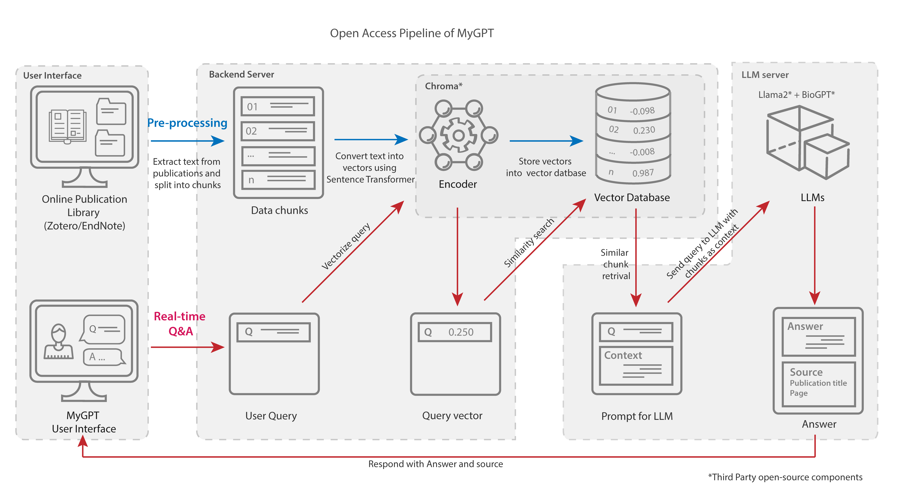
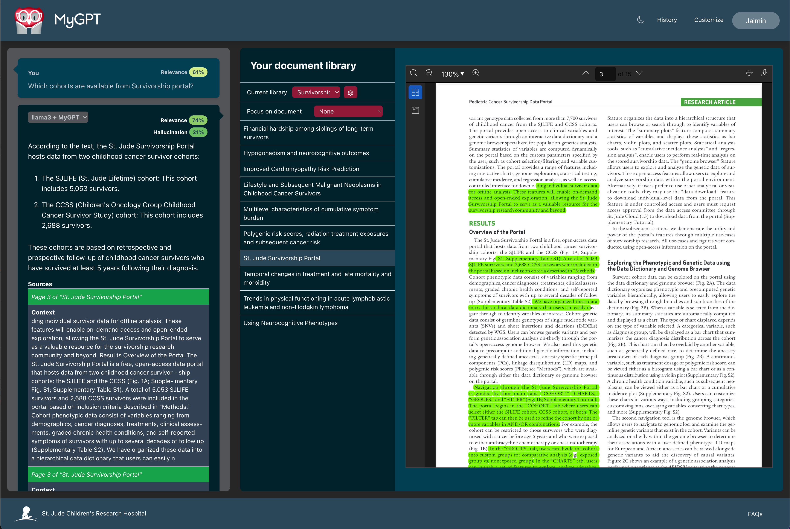

<!-- make div and show logo in middle -->

	

# MyGPT_public

<b>Note: This repository contains installation instructions for the MyGPT with Docker images and will not need source code. If you need access to MyGPT source to help in development process, please contact Jaimin Patel (Email: jaimin.patel@stjude.org) or appropriate person.</b>

ChatGPT has revolutionized creative occupations, but tasks requiring factual backing suffer from generalized models and limitations such as hallucinations and inconsistency. Here, we present MyGPT — an open-source Large Language Model (LLM) pipeline to ask questions for content from a curated list of publications or video/audio lectures. MyGPT minimizes hallucination by providing a context for the question and generates accurate answers with source citing. MyGPT can run on personal devices or cloud infrastructures and can help with complex tasks such as literature review and learning. 

## Pipeline

We have divided the MyGPT pipeline architecture into three sections: 
1. <ins>User interface (UI)</ins>: The UI is the front-end of the pipeline. It is a web application that allows users to interact with the pipeline. The UI is built using ReactJS.
2. <ins>Backend server</ins>: The backend server is responsible for handling requests from the UI and sending them to the LLM server. The backend server is built using Python Django.
3. <ins>LLM server</ins>: The LLM server is responsible for generating answers to the questions asked by the user. We are using Ollama for the LLM server.

## Installation

MyGPT can be installed on following environments:

- [Personal Computer](#personal-computer)
- Server/VM with/without GPU (coming soon)
- Amazon Web Services (AWS) (coming soon)

### Personal Computer

MyGPT is using Ollama for LLM server, and it requires at least 8GB (16GB for better response time) of RAM and 10GB of disk space.
Also, Ollama is providing direct installation on Mac and Linux only. For Windows users we will use Docker to run Ollama.

To run the pipleine on following environments, follow the instructions:
* Mac
	- [Basic Installation](./installation/macOS/README.md)
	<!-- - Detailed instructions: 
	This are instructions with interactive Jupyter notebook on Google colab, it has troubleshooting steps. If you come across any bug or error, please report it in the issues section. You can also modify Jupyter notebook as per your convenience. -->
* Linux
	- [Basic Installation](./installation/linux/README.md)
	<!-- - Detailed instructions: 
	This are instructions with interactive Jupyter notebook on Google colab, it has troubleshooting steps. If you come across any bug or error, please report it in the issues section. You can also modify Jupyter notebook as per your convenience. -->
* Windows 
	- [Basic Installation](./installation/windows/README.md)
	<!-- -  -->

	These instructions are simple and easy to follow. You can also modify bash scripts as per your convenience.

## User Interface
MyGPT user interface will allow users to check the publcation library, ask questions, and get answers. The user interface is built using ReactJS.

Here is an example of the user interface with question, answer, and source citing:

## Issues

If you come across any bug or error, please report it in the [issues](https://github.com/smb-group/MyGPT_public/issues) section.
