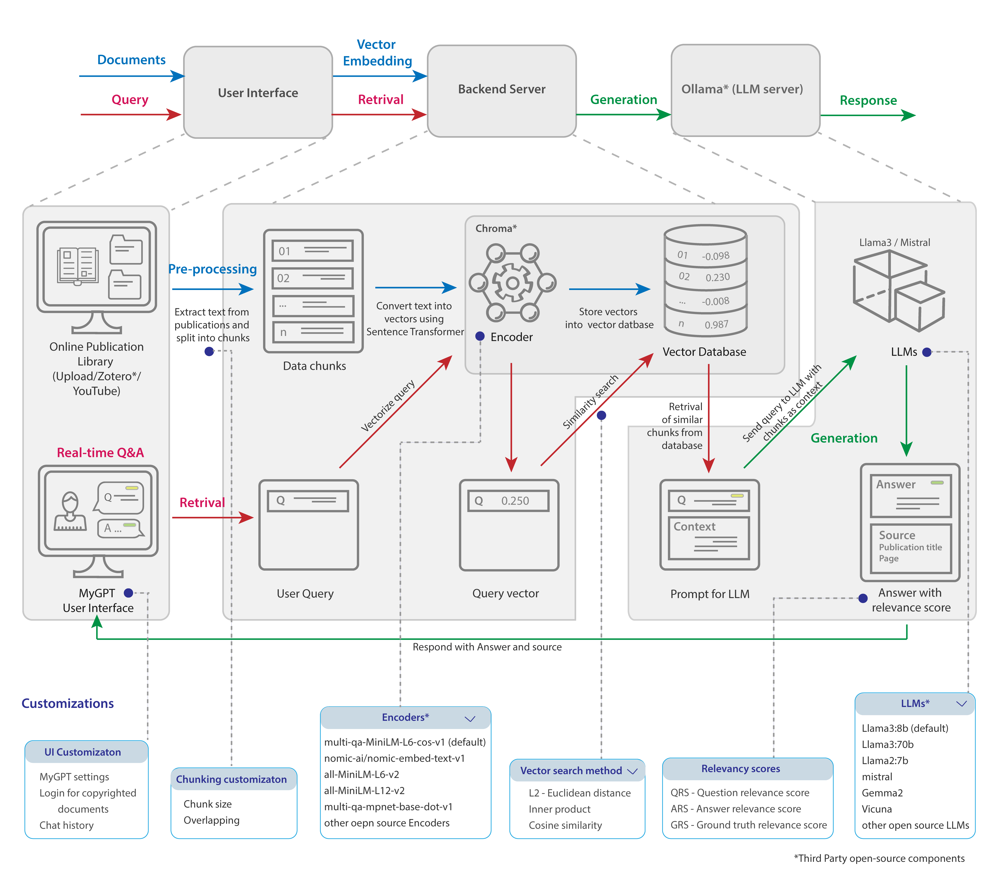

# MyGPT

This repository contains installation instructions and images for the MyGPT.

## introduction

ChatGPT has revolutionized creative occupations, but tasks requiring factual backing suffer from generalized models and limitations such as hallucinations and inconsistency. Here, we present MyGPT — an open-source Large Language Model (LLM) pipeline to ask questions for content from a curated list of publications or video/audio lectures. MyGPT minimizes hallucination by providing a context for the question and generates accurate answers with source citing. MyGPT can run on personal devices or cloud infrastructures and can help with complex tasks such as literature review and learning. 

## Pipeline

We have divided the MyGPT pipeline architecture into three sections: 
1. <b>User interface (UI)</b>: The UI is the front-end of the pipeline. It is a web application that allows users to interact with the pipeline. The UI is built using ReactJS.
2. <b>Backend server</b>: The backend server is responsible for handling requests from the UI and sending them to the LLM server. The backend server is built using Python Django.
3. <b>LLM server</b>: The LLM server is responsible for generating answers to the questions asked by the user. The LLM server is built using Django and Llama-CPP-Python.

## Installation

MyGPT can be installed on following environments:

- [Personal Computer - no GPU](#personal-computer---no-gpu)
- [Personal Computer - with GPU](#personal-computer---with-gpu)
- Google Colab (coming soon)
- Server with GPU (coming soon)
- Amazon Web Services (AWS) - GPU (coming soon)

### Personal Computer - no GPU

For this installtion, the entire pipeline will run as a single unit on CPUs. This is the easiest way to get started with MyGPT, but it is also the response time will be slowest.

To run the pipleine on following environments, follow the instructions from the Google colab notebook:
* Mac without GPU
	- [Simple instructions](./installation/pc_no_gpu/macOS/README.md): This are simple insturctions with bash scripts, although it's easy to follow, it's not interactive and doesn't have troubleshooting steps. If you come across any bug or error, please report it in the issues section. You can also modify bash scripts as per your convenience.
	- Detailed instructions: 
	This are instructions with interactive Jupyter notebook on Google colab, it has troubleshooting steps and is easy to follow. If you come across any bug or error, please report it in the issues section. You can also modify Jupyter notebook as per your convenience.
* Linux without GPU
	- [Simple instructions](./installation/pc_no_gpu/linux/README.md): This are simple insturctions with bash scripts, although it's easy to follow, it's not interactive and doesn't have troubleshooting steps. You can also modify bash scripts as per your convenience.
	- Detailed instructions: 
	This are instructions with interactive Jupyter notebook on Google colab, it has troubleshooting steps. If you come across any bug or error, please report it in the issues section. You can also modify Jupyter notebook as per your convenience.
* Windows without GPU 

### Personal Computer - with GPU

For this installation, the LLM API will run on Apple GPU, and remaining pipeline will run via Docker on CPUs. 
The steps will differ slightly for this method, although installation time should be same.
Because we are using GPU for this method, the response time will be much faster than the previous method.

To run the pipleine on following environments, follow the instructions:
* Mac with Apple GPU
	- [Simple instructions](./installation/pc_with_gpu/macOS/README.md): This are simple insturctions with bash scripts, although it's easy to follow, it's not interactive and doesn't have troubleshooting steps. You can also modify bash scripts as per your convenience.
	- Detailed instructions: 
	This are instructions with interactive Jupyter notebook on Google colab, it has troubleshooting steps. If you come across any bug or error, please report it in the issues section. You can also modify Jupyter notebook as per your convenience.

## User Interface
MyGPT user interface will allow users to check the publcation library, ask questions, and get answers. The user interface is built using ReactJS.

Here is an example of the user interface with question, answer, and source citing:

## Issues

If you come across any bug or error, please report it in the [issues](https://github.com/mb-group/MyGPT_public/issues) section.